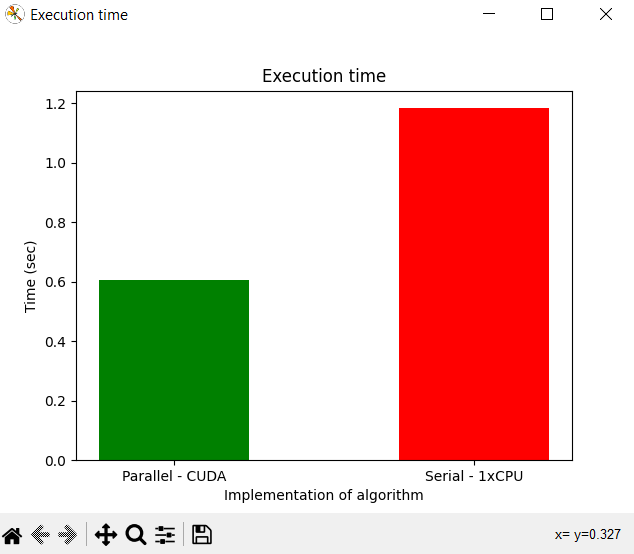
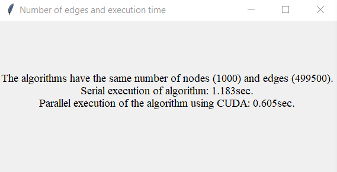

# Dijkstra - CUDA
The implementation of the Dijkstra algorithm has been carried out both serially and in parallel using CUDA technology at the Faculty of Informatics and Digital Technologies. This implementation aims to enhance the performance and efficiency of the algorithm through the utilization of parallel processing capabilities offered by CUDA. Additionally, time execution for both versions (serial and parallel) was measured to evaluate the performance improvement. The implementation serves as a valuable resource for the college community in furthering their understanding and application of the Dijkstra algorithm.

Students:
- Rene Frlan
- Antonio Janach

## Requirements for using pyCUDA:
- A NVIDIA GPU that supports CUDA
- A compatible version of the NVIDIA CUDA Toolkit installed on your system
- PyCUDA package which can be installed via pip
- A compatible version of the NVIDIA driver
- A compatible version of python
- A compatible operating system (Windows, Linux, or MacOS)

To use the code, a virtual environment for Python needs to be created inside the directory where the code was downloaded. This is done by going to the code's directory using the cd command and then running a command in the shell of the system. This is to prevent any anomalies in the system Python installation.
```sh
python3 -m venv env
```

To run the program, all necessary modules need to be installed, which can be done as specified:
```sh
pip install -r requirements.txt
```

## Basic instructions for using the algorithm

When running the graph.py code file, the time execution for both serial and parallel (CUDA) versions of the Dijkstra algorithm is measured. The process begins by inputting the number of nodes for both versions of the algorithm. The execution time is then measured and presented through a graph for easy comparison and analysis.
```sh
python3 graph.py
```

But if you want you can choose to run serial or parallel (CUDA) version of algorithm. In that case you need uncoment these lines: 
```python
nodeNumber = int(input("Number of nodes: "))
edgeNumber = test_parallel_dijkstra_gpu(nodeNumber)[1]
executionTime = execution_time(nodeNumber)
print(f"Parallel execution of algorithm have {nodeNumber} number of nodes and {edgeNumber} number of edges. \n" \
      f"Parallel execution of the algorithm using CUDA: {executionTime:.3f}sec. \n")
```

## Example outputs:

Running graph.py code where node namber for both algorithm are the same (1000):

graph  


text box  
